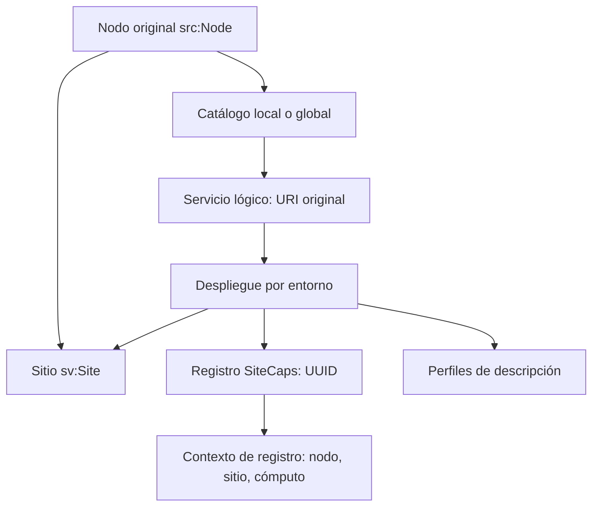
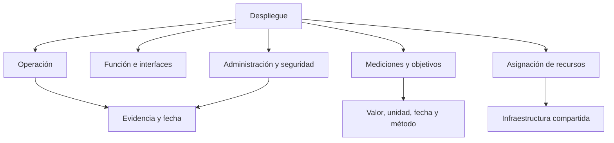
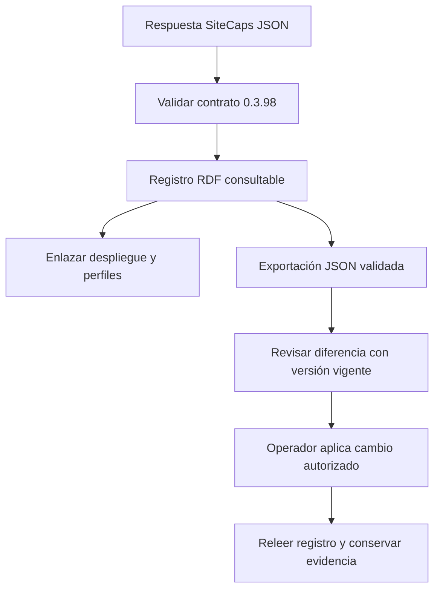

# Modelo semántico de servicios SRCNet

## Objetivo

El modelo original describe centros, nodos, infraestructura y catálogos. Esta
extensión conserva esa estructura y desarrolla la descripción de cada servicio.
Permite responder qué función ofrece, dónde se ejecuta, de qué depende, quién
lo administra, qué recursos consume y con qué evidencia conocemos su estado.

Se distinguen tres identidades:

1. **Servicio lógico** (`sv:Service`): identidad estable dentro del catálogo.
2. **Despliegue** (`sv:Deployment`): realización del servicio en un entorno y sitio.
3. **Registro SiteCaps** (`sv:SiteCapsRecord`): objeto externo con UUID y contrato propio.

Un servicio puede tener varios despliegues. Un despliegue puede realizar varias
capacidades: por ejemplo, Skaha participa en la plataforma CANFAR y ejecuta
notebooks. El chart Helm, la aplicación y la imagen tienen versiones distintas.
Una observación temporal no cambia la identidad del servicio lógico.

`sv:hostedAt` significa alojamiento real. `sv:consumesService` significa uso de un
servicio externo. Un IAM global consumido por espSRC no pasa a estar alojado en
espSRC. Los padres que devuelve SiteCaps describen su ubicación en el registro:
no deben usarse automáticamente como prueba del alojamiento físico de IAM.

## Cinco dimensiones

| Dimensión | Entidades y propiedades | Qué permite conocer |
|---|---|---|
| Operativa | `OperationalProfile`, `health`, `lifecycle`, `MaintenanceWindow`, endpoints de salud/métricas | Estado observado, ciclo de vida, monitorización y ventanas de mantenimiento |
| Funcional | `FunctionalProfile`, `function`, `format`, `dcterms:conformsTo`, `Endpoint`, `Dependency` | Capacidades, estándares, formatos, interfaces y dependencias |
| Rendimiento | `Measurement`, `ServiceObjective`, `qudt:QuantityValue`, fecha, método y ventana | Latencia, throughput, disponibilidad, límites y objetivos comparables |
| Administración | `AdministrationProfile`, `operator`, `supportURL`, `runbook`, `escalation`, `backupPolicy`, `SecurityProfile` | Responsabilidad, soporte, cambios, respaldo y políticas de acceso |
| Recursos | `ResourceAllocation`, `InfrastructureResource`, `allocationKind`, namespace, software | Recursos solicitados, límites, cuotas y recursos compartidos de cómputo, red o almacenamiento |

Las unidades se expresan mediante QUDT. Los valores de ejemplo usan segundos,
bytes y porcentaje. Para nuevos indicadores hay que acordar nombre, unidad,
método, alcance y ventana antes de comparar nodos. No se suma la capacidad total
de un clúster una vez por servicio: las asignaciones se enlazan a un recurso
compartido y distinguen `request`, `limit`, `quota` y `allocated`.

## Estado administrativo y salud

`is_force_disabled=false` solo levanta la desactivación administrativa. No
afirma disponibilidad: puede haber mantenimiento, un padre deshabilitado, un
endpoint caído o una dependencia fallando. Los resultados de descubrimiento
también dependen de `include_inactive` y de los filtros de la API.

Por eso el modelo no define `enabled = healthy`. La salud requiere una medición
con fecha y método; una versión declarada en GitOps tampoco prueba que el
servicio esté funcionando. El ejemplo espSRC utiliza `health="unknown"`.

Para derivar disponibilidad efectiva, una aplicación debe reunir el registro,
el estado de sus padres, sus ventanas activas, la salud y las dependencias. Si
faltan esas evidencias, el resultado es desconocido. Este paquete no implementa
un evaluador de disponibilidad ni sustituye Prometheus o el control plane.

## Local y global

La estructura de los perfiles es idéntica para ambos ámbitos. `scope` clasifica
el servicio; el sitio identifica el despliegue. El fichero
`global-service-template.jsonld` muestra un IAM **ficticio** con perfiles,
recursos y objetivo de disponibilidad. Al introducir datos reales se sustituyen
sus URI `example.org`, propietario, sitio y evidencias, conservando la separación
entre consumidores y anfitrión. No se inventan estos datos para el IAM real.

## Evidencia y cambios

Cada despliegue tiene una fuente fechada. `reported` corresponde a información
comunicada por el operador; `observed` a una observación directa; `proposed` a
una decisión pendiente o interpretación; `synthetic` a un ejemplo de prueba.
Las mediciones llevan además `prov:generatedAtTime`. Las observaciones históricas
deben recibir identidades propias; un colector puede guardarlas en grafos con
nombre y mantener el perfil vigente aparte.

La ausencia de una propiedad significa «no conocido». No equivale a `false`, a
cero o a una cadena vacía. El perfil de intercambio SiteCaps es más estricto que
un inventario parcial: si faltan campos requeridos, no se exporta inventando
valores. Las credenciales, tokens y secretos no forman parte del modelo.

## Flujo de integración

La última parte es un procedimiento operativo documentado. El adaptador se
limita a ficheros; no envía solicitudes. Las pruebas comprueban que un recorrido
JSON → RDF → JSON mantiene el contenido y que una edición RDF del flag se
refleja correctamente sin añadir una afirmación sobre salud.
