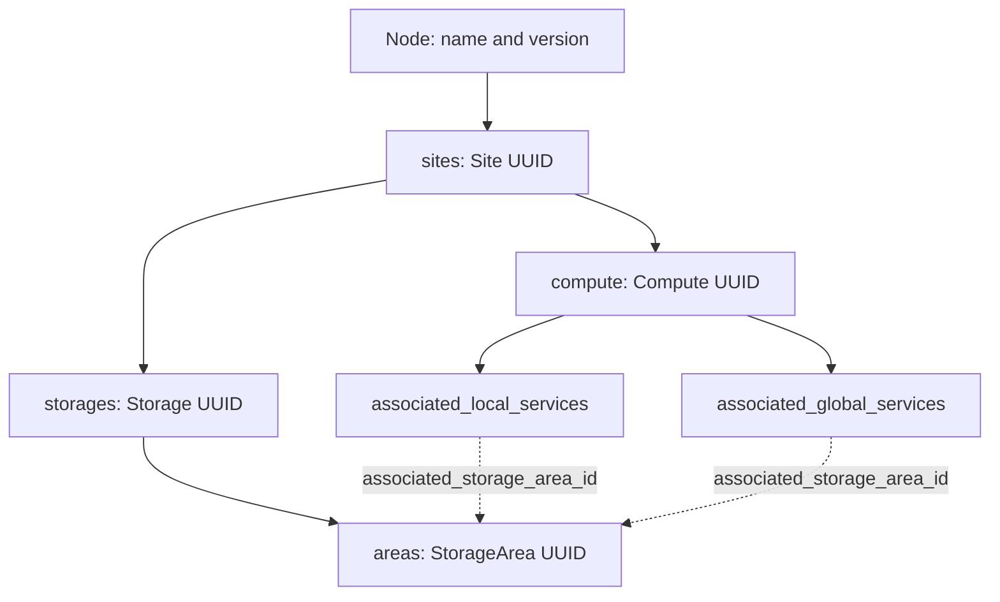

# SiteCaps compatibility profile

## Evidence and contract pin

Primary sources inspected on 2026-10-06:

* [Deployed operator documentation](https://site-capabilities.srcnet.skao.int/api/v1/www/docs/oper#overview), embedded OpenAPI `info.version=0.3.98`.
* [Deployed type list](https://site-capabilities.srcnet.skao.int/api/v1/services/types).
* [Local-service form schema](https://site-capabilities.srcnet.skao.int/api/v1/schemas/local-service).
* [Global-service form schema](https://site-capabilities.srcnet.skao.int/api/v1/schemas/global-service).
* [Source tree at inspected commit](https://gitlab.com/ska-telescope/src/src-service-apis/ska-src-site-capabilities-api/-/tree/f99d9f7e0d21e7488e2802e4b4e6130601c420d1).

Snapshots and provenance are in `sitecaps/vendor/`. The live form schemas use
UI-specific `type: enum`, `textarea`, `text` and property-level `required` values;
they are **not** passed to a standard JSON Schema validator. The adapter uses
the deployed OpenAPI components (JSON Schema 2020-12 semantics) with format
checking enabled. This is a strict interchange profile: actual responses with
nulls where OpenAPI says string will be rejected rather than guessed.

The source checkout is corroborating evidence, not proof of the deployed Git
revision. In particular, source `main` has `job_gateway` while the retrieved
type endpoint and OpenAPI do not. Both snapshot and scope determine compatibility.

## Shape of the native hierarchy



Both service scopes are associated with compute records. A global service is
not a child of a separate top-level global REST collection. Returned parent
metadata and `associated_compute_id` have distinct meanings and must not be
collapsed. `nest_in_node()` operates on a complete existing node document,
replaces one existing service by UUID and preserves sibling resources.

## Field mapping

| SiteCaps JSON | Semantic property | Rule |
|---|---|---|
| `id` | `sv:siteCapsId` | UUID string on registration, not logical service identity |
| `type` | `sv:siteCapsType` | Exact enum for the selected scope |
| `scope` / nesting context | `sv:scope` | Required adapter argument; conflicting JSON scope rejected |
| `name` | `sv:name` | String, preserved |
| `version` | `sv:version` | Registration version string; do not substitute chart version |
| `prefix` | `sv:prefix` | URL scheme component, preserved |
| `host` | `sv:host` | Host component, preserved |
| `port` | `sv:port` | Integer, per OpenAPI minimum 0 |
| `path` | `sv:path` | Exact path; empty string differs from `/` |
| `is_force_disabled` | `sv:isForceDisabled` | Typed boolean; no health inference |
| `is_mandatory` | `sv:isMandatory` | Required for local; rejected for global in this profile |
| `associated_compute_id` | `sv:associatedComputeId` | Optional associated UUID; distinct from parent compute |
| `associated_storage_area_id` | `sv:associatedStorageAreaId` | Optional associated area UUID |
| `parent_node_name` | `sv:parentNodeName` on context | Discovery provenance, never guessed from espSRC spelling |
| `parent_site_name` | `sv:parentSiteName` on context | Discovery provenance |
| `parent_site_id` | `sv:parentSiteId` on context | Site UUID |
| `parent_compute_id` | `sv:parentComputeId` on context | Containing compute UUID |
| `other_attributes` | `sv:otherAttributes` as `rdf:JSON` | Arbitrary JSON object preserved, including unrelated keys |
| `downtime` | `sv:downtimeJSON` + `sv:maintenance` | Original array preserved; intervals projected to typed timestamps |
| Unknown fields | `sv:extraFields` as `rdf:JSON` | Preserved without semantic inference |

The `SiteCapsRecord` IRI is generated using UUIDv5 over registry base + service
UUID. It is a semantic identity for a registration, not a UUID to send back to
SiteCaps. Only the original `id` is exported. Explicit `scope` presence is retained
in `extraFields` so nested objects round-trip without an added field.

Scalar RDF properties are authoritative on export. JSON containers are
authoritative for `other_attributes` and `downtime`; maintenance RDF must match
the JSON projection or export fails. To edit maintenance, update the JSON source
and re-import it. This avoids silently exporting contradictory dates. Downtime
ranges additionally require offset-aware timestamps and start < end.

## Service types

| Scope | Accepted values in the deployed snapshot |
|---|---|
| local | `echo`, `jupyterhub`, `binderhub`, `dask`, `ingest`, `soda_sync`, `soda_async`, `gatekeeper`, `monitoring`, `perfsonar`, `canfar`, `carta`, `prepare_data`, `gaussconv`, `cavern`, `product_streamer` |
| global | `rucio`, `iam`, `data-management-api`, `site-capabilities-api`, `permissions-api`, `auth-api`, `gms`, `global-execution-api`, `accounting-api` |

`notebook`, `skaha`, `posix-mapper`, `science-gateway`, `datalake`, `registry` and
`soda` are semantic kinds, not values to submit as `type`. The model keeps them
as `sv:serviceKind`. A service-kind-to-API-type mapping must be agreed per
registration; unsupported services remain semantic-only until SiteCaps evolves.

## Rich metadata without changing SiteCaps

The full graph can live in a version-controlled file or triple store. A proposed
link convention in an existing `other_attributes` object is:

```json
{
  "srcnet_semantic": {
    "profile_version": "0.1.0",
    "service_iri": "https://example.org/srcnet/service/example",
    "deployment_iri": "https://example.org/srcnet/deployment/example-production",
    "description_url": "https://example.org/metadata/example.jsonld"
  }
}
```

Merge this key into existing attributes; never replace unrelated application
configuration. These example URLs are placeholders. The adapter preserves the
object without dereferencing arbitrary URLs. A consumer can explicitly fetch
trusted metadata and join the service/deployment IRIs. This convention does not
claim that current SiteCaps clients interpret semantic metadata themselves.

## Operational routes

Use the deployed API base `https://site-capabilities.srcnet.skao.int/api/v1`.
The embedded OpenAPI contains paths beginning `/v1` and a server `/api/v1`;
blind concatenation would duplicate `v1`. Its published curl examples and the
successfully retrieved schema/type URLs use a **single** `/api/v1` prefix.

| Method and suffix | Purpose | Body |
|---|---|---|
| `GET /services?include_inactive=true&service_scope=all` | Discover registrations including inactive services | None |
| `GET /services/types` | Check deployed service kinds | None |
| `GET /services/{service_id}` | Retrieve one service | None |
| `PUT /services/{service_id}/enable` | Unset `is_force_disabled` | None |
| `PUT /services/{service_id}/disable` | Set `is_force_disabled` | None |
| `GET /nodes/{node_name}?node_version=latest` | Obtain current complete node | None |
| `GET /schemas/{schema}` | Obtain UI definition schema | None |

List filters include `node_names`, `site_names`, `service_types`, `service_scope`,
`include_inactive`, `associated_storage_area_id`, and `output`. Missing services
from an active-only response are not proof that they do not exist.

For example, after obtaining an authorised token and a **real** service UUID:

```bash
SITE_CAPS_BASE=https://site-capabilities.srcnet.skao.int/api/v1
curl --fail-with-body --request PUT \
  --header "Authorization: Bearer ${SITECAPS_TOKEN}" \
  "${SITE_CAPS_BASE}/services/${SERVICE_UUID}/enable"
```

This command is documentation only and has not been executed. There is no
`POST /services` or general service PATCH operation in the retrieved OpenAPI.
The inspected source defines `POST /nodes` and `POST /nodes/{node_name}` with
`include_in_schema=False`; these power whole-node creation/editing. Their
availability on this deployment has not been exercised. Prefer the operator UI
for registration updates until that contract is confirmed with the operator.

To prepare a node update, retrieve the full current node, select its actual
compute UUID, apply `nest_in_node()` locally, inspect the diff, and re-read the
node version immediately before submission. The adapter rejects missing or
ambiguous targets and parent mismatches. It does not provide a transaction or
optimistic concurrency protocol for SiteCaps, so concurrent edits still require
operator coordination. Never submit a sparse example as a replacement node.

Authentication follows SiteCaps operator documentation: service-specific token
audience (default `site-capabilities-api`), expected scope (default
`site-capabilities-api-service`) and Permissions API/IAM group authorization.
Credentials are not stored in examples. Successful enable/disable changes the
administrative flag only; check the returned value and reread the service.

## Deliberate limits

* Strict contract conformance is offline; no authenticated production read/write integration test.
* Node, storage and queue APIs are contextual links, not full RDF round-trip adapters here.
* Export requires one known registration with an existing UUID, not an incomplete logical service.
* Unknown fields round-trip but do not gain invented RDF meaning.
* RDF JSON values retain JSON semantics, not original whitespace or byte order.
* No automatic service-type coercion, health inference, resource aggregation or remote context fetching.
